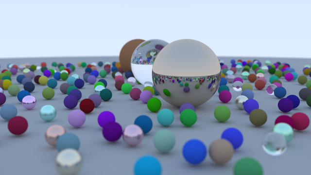
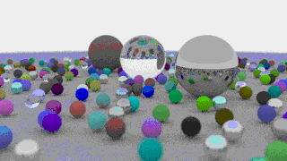

Implemented [Ray Tracing in One Weekend][ref_rtw] in Go on a flight from GDN to SEA, and added animation and multicore
processing on a flight back.

[ref_rtw]:https://raytracing.github.io/books/RayTracingInOneWeekend.html





To run:

```
make

# static

./bin/main -scene balls -p 20

# the animation

./bin/main -animate -frames 180 -scene balls -p 50 -d 25
```

### Go highlights

Renaming variables or types is a breeze.

Fast iterations. Most of the time if IDE does not show anything red it will work.

Adding multiprocessing was very easy.

### Go quirks

I couldn't put all the code in a single "main" package with many files within the "package main".  I had to have a
namespaced module with all the library code and the main.

### Go lowlights

For type aliases, the functions of the base (aliased) type are not available to the alias. One needs to un-alias to base
type to apply the methods, for example:

```
p := point3{0, 0, 0}
vec3(p).sub(vec3(p))
```

To overcome it you need to express aliases as composites

```
type foo struct {
    baseType
}
```

Warning on unkeyed fields of composite literal, when I didn't want to use composite literals at all.  I was forced to
use the composite literal to be able to access the base Vec3 methods.

Lack of implicit type (un)aliasing makes the syntax cumbersome.

Lack of possibility of overloading infix and other built-in operators makes it cumbersome to express math operations,
line foo + bar instead of foo.Add(bar).

```
C++: v - 2*dot(v,n)*n;
Go: v.Sub(n.Mul(2 * v.Dot(n)))
```

